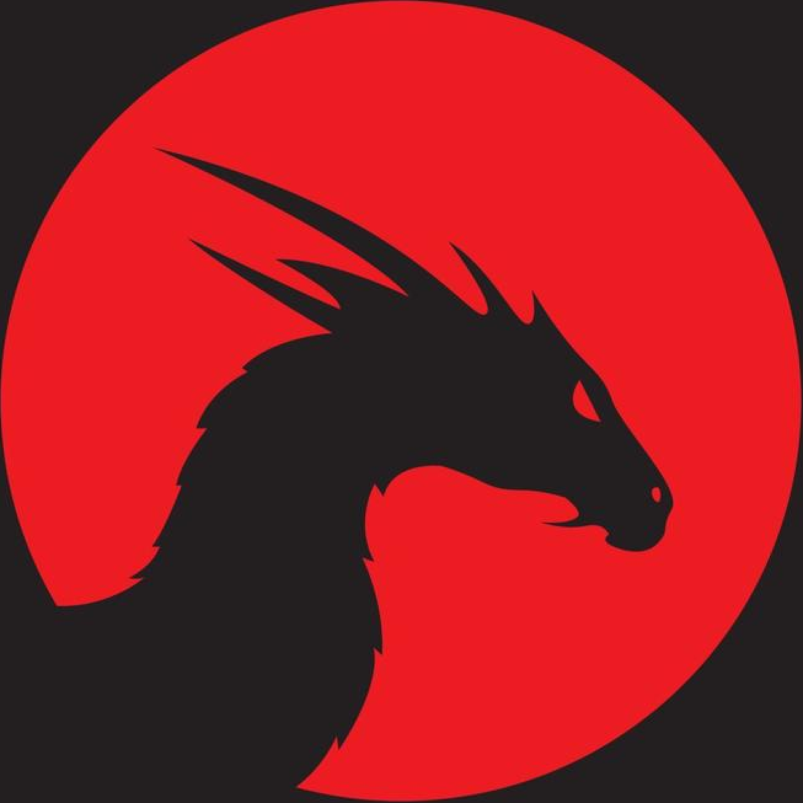

<p align="center">
  
</p>

<h1 align="center">SOM</h1>

<p align="center">
  <b>Stream music from YouTube — free, offline-capable, and beautiful..</b>
</p>

<p align="center">
  
  
  
  
</p>

<p align="center">
  
</p>
---

## Features

| Feature | Description |
|---------|-------------|
|  **Search** | Search YouTube for any song or artist |
|  **Stream** | Stream audio directly without downloading the full video |
|  **Offline Playback** | Download tracks to a local playlist for offline listening |
|  **Synced Lyrics** | Real-time synced lyrics via LRCLib + YouTube subtitles fallback |
|  **Media Controls** | Lock screen & notification controls (play, pause, skip, seek) |
|  **Shuffle & Repeat** | Shuffle, repeat-all, and repeat-one modes |
|  **Dynamic Theming** | Album art-based color extraction for immersive UI |
|  **Audio Settings** | Configurable buffer size and sample rate |

---

## Architecture

```
SOM/
├── cmd/server/          # Go backend entry point
│   └── main.go          # HTTP server (chi router)
├── internal/
│   ├── handler/         # API route handlers
│   │   ├── search.go    # GET /api/v1/search
│   │   ├── stream.go    # GET /api/v1/stream
│   │   ├── lyrics.go    # GET /api/v1/lyrics
│   │   └── resolve.go   # GET /api/v1/resolve
│   ├── scraper/         # YouTube data extraction
│   │   ├── ytdlp.go     # yt-dlp wrapper
│   │   ├── lrclib.go    # LRCLib lyrics API
│   │   └── ...          # VTT parser, fallback scrapers
│   └── cleaner/         # Audio stream processing
├── app/                 # React Native (Expo) mobile app
│   ├── src/
│   │   ├── screens/     # HomeScreen, SearchScreen, NowPlayingScreen, ...
│   │   ├── components/  # MiniPlayer, MusicCard, SyncedLyrics, ...
│   │   ├── contexts/    # PlayerContext (global audio state)
│   │   ├── services/    # API client, media controls, playlist store
│   │   ├── hooks/       # Custom React hooks
│   │   ├── navigation/  # React Navigation setup
│   │   └── theme/       # Colors, typography
│   └── assets/          # App icons, splash screen
└── go.mod               # Go module definition
```

**Backend** — A lightweight Go HTTP server that proxies YouTube audio and lyrics.

**Frontend** — A React Native app built with Expo, featuring background audio playback, offline downloads, and synced lyrics.

---

## Getting Started

### Prerequisites

- **Go** 1.25+
- **Node.js** 18+ & **npm**
- **yt-dlp** installed and available in `$PATH`
- **Android Studio** (for Android builds) or **Xcode** (for iOS builds)
- **Expo CLI** — `npm install -g expo-cli`

### 1. Clone the repository

```bash
git clone https://github.com/GianT404/SOM.git
cd SOM
```

### 2. Start the backend

```bash
cd cmd/server
go build -o server .
./server
```

The server starts on port `8080` by default. Configure with environment variables:

| Variable | Default | Description |
|----------|---------|-------------|
| `PORT` | `8080` | Server port |
| `YTDLP_PATH` | `yt-dlp` | Path to yt-dlp binary |

### 3. Start the mobile app

```bash
cd app
npm install --legacy-peer-deps
npx expo start
```

Then press `a` to open on Android emulator, or scan the QR code with **Expo Go**.

### Build APK (Android)

```bash
cd app
npx expo run:android
```

---

## API Endpoints

| Method | Endpoint | Params | Description |
|--------|----------|--------|-------------|
| `GET` | `/api/v1/search` | `q` — search keyword | Search YouTube for tracks |
| `GET` | `/api/v1/stream` | `id` — YouTube video ID | Proxy audio stream |
| `GET` | `/api/v1/lyrics` | `id` — YouTube video ID | Fetch synced lyrics |
| `GET` | `/api/v1/resolve` | `id` — YouTube video ID | Resolve stream URL |
| `GET` | `/health` | — | Health check |

---
##  Tech Stack

### Backend
- **Go** — Fast, compiled HTTP server
- **Chi** — Lightweight HTTP router
- **yt-dlp** — YouTube audio extraction
- **LRCLib** — Synced lyrics database

### Frontend
- **React Native** — Cross-platform mobile framework
- **Expo** — Managed workflow & native modules
- **expo-av** — Audio playback engine
- **expo-media-control** — System media controls (notification & lock screen)
- **React Navigation** — Screen navigation
- **AsyncStorage** — Local data persistence

---

## License

This project is for **personal/educational use only**. It relies on YouTube content and should not be used for commercial purposes.

---

<p align="center">
  Made by <b>ミＧＩＡＮ4０４シ</b>
</p>
